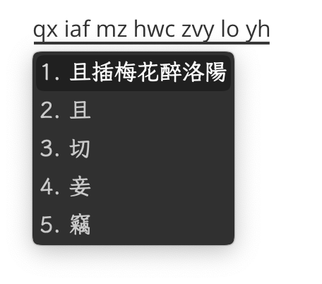

[中文](README.md)

<h1 align="center">Moran</h1>

<p align="center">
<a href="https://github.com/rimeinn/rime-moran/issues"></a>
<a href="https://zrmfans.cn/demo/"></a>
</p>

License: [GPL v3](https://www.gnu.org/licenses/gpl-3.0.en.html). If a file indicates another license, you may use/redistribute it according to that license as well.

---

Plum Recipe: ℞ `rimeinn/rime-moran@trad` for Traditional Chinese ([Try Online](https://zrmfans.cn/demo/))

Plum Recipe: ℞ `rimeinn/rime-moran@simp` for Simplified Chinese ([Try Online](https://zrmfans.cn/zh-Hans/demo/))

Moran is an advanced Rime schema based on Ziranma, designed for fast, precise, and intuitive Chinese typing. The name "Moran" signifies a "Radically-modified Ziranma" in Chinese. It attempts to strike a balance among "Orthography", "Efficiency", and "Experience".

Moran prioritizes native support for Traditional Chinese Characters. It utilizes Ziranma's [double pinyin (or _shuangpin_)](https://en.wikipedia.org/wiki/Chinese_input_methods_for_computers#Shuangpin) and [shape-based](https://en.wikipedia.org/wiki/Chinese_input_methods_for_computers#Shape-based) auxiliary code.  Moran features [multiple input modes](https://github.com/rimeinn/rime-moran/wiki/%E5%90%84%E8%BC%B8%E5%85%A5%E6%A8%A1%E5%BC%8F%E8%AA%AA%E6%98%8E), [five distinct lookup methods](https://github.com/rimeinn/rime-moran/wiki/%E6%95%99%E7%A8%8B#%E5%85%B6%E4%BA%94%E6%9B%B0%E4%BA%94%E9%87%8D%E5%8F%8D%E6%9F%A5), and above all, a massive charset of \~80,000 Chinese characters and \~1,000,000 words, along with various quick-input conveniences. Please refer to [our wiki](https://github.com/rimeinn/rime-moran/wiki) for details.

> [!TIP]
> If you are interested in other phonetic schemas or auxiliary code schemas, please refer to [rime-molong](https://github.com/rimeinn/rime-molong).

Moran is an open, [community-maintained](https://zrmfans.cn/book/misc/acknowledgement.html) project. Join us!

- [Learn more](https://zrmfans.cn)

| Quick Code                              | Assisted Sentence Composition                               |   |
|-----------------------------------------|-------------------------------------------------------------|---|
|  |  |   |

Assisted Candidate Filtering

https://github.com/user-attachments/assets/ca8a8c1f-d076-47de-94b0-4e935a99a516

# Schema Maintenance

You may use the following commands to do daily maintenance on the `master` branch:

```bash
make quick                           # Quickly update character information
make dict                            # Update auxiliary code in dicts
make dist                            # Produce a distribution under ./dist
make dist DESTDIR=~/Library/Rime     # Install the distribution to DESTDIR
make test                            # Unit testing
./make_simp_dist.sh                  # Produce a simplified distribution under ./dist
```

Note: You MUST first `make quick` before deploying the `master` branch.
